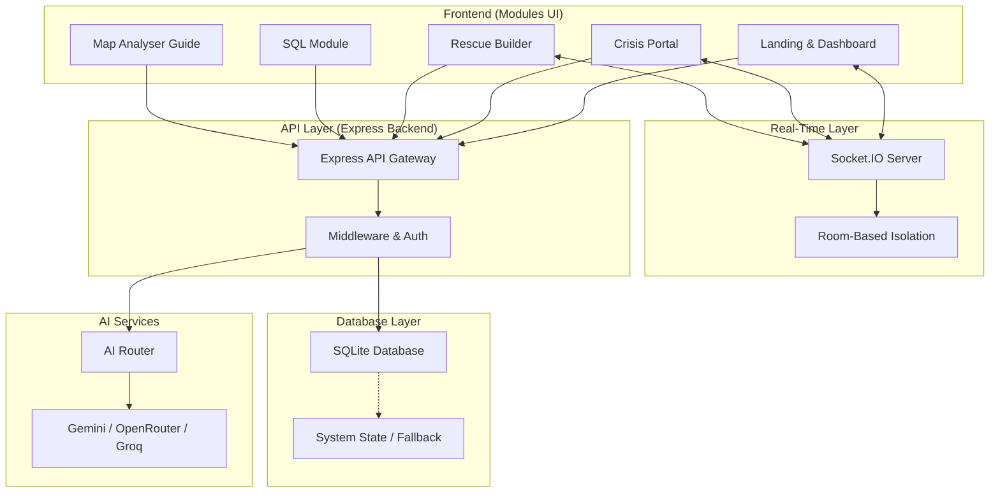
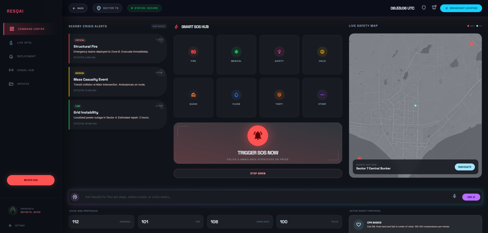
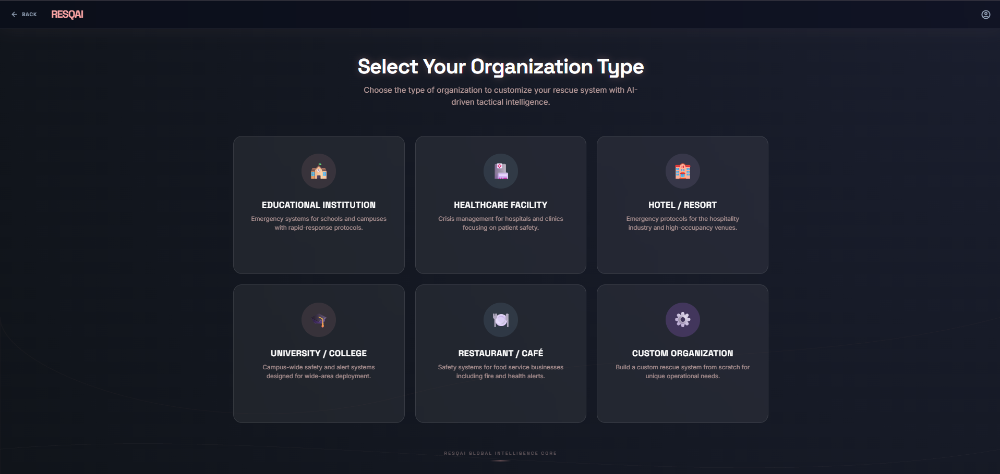
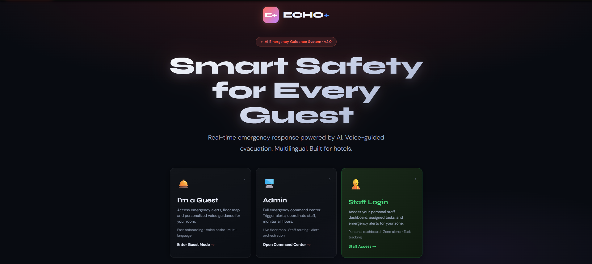
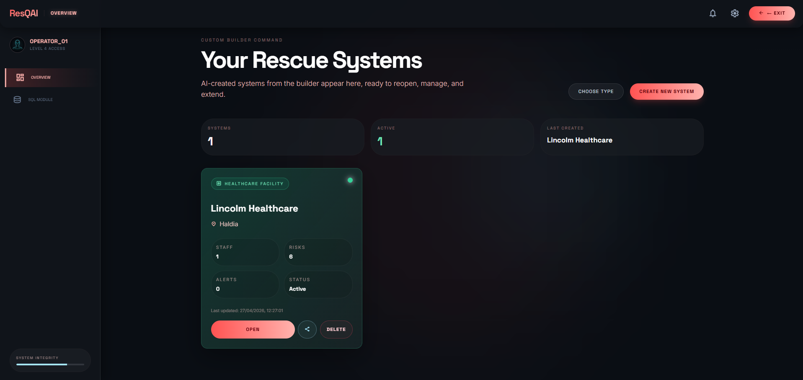
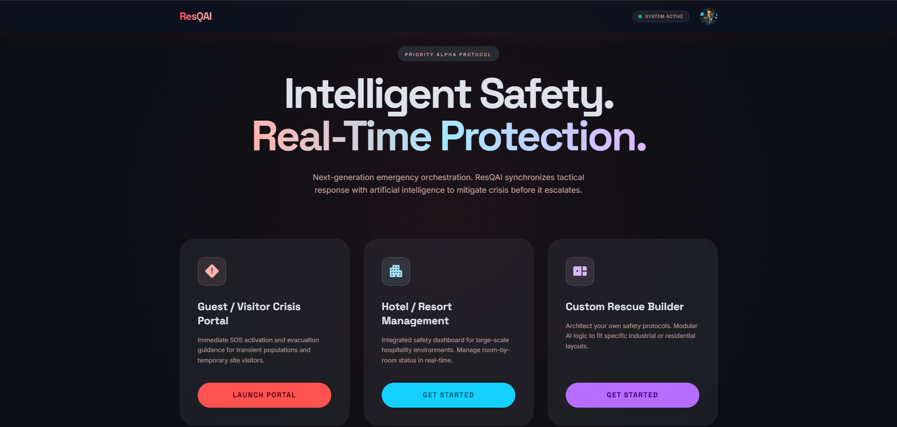

# 🚨 ResQAI – AI Crisis Intelligence System

**Empowering Rapid Emergency Response with AI-Driven Intelligence**

> ResQAI is a next-generation crisis management platform designed to bridge the gap between emergency onset and professional responder arrival. By leveraging multi-provider AI, real-time WebSocket coordination, and AI-powered map analysis, ResQAI provides life-saving guidance when every second counts.

---

## 🧠 Overview

In high-stress emergency scenarios—especially in hospitality and unfamiliar environments—individuals often lack clear, actionable information. **ResQAI** solves this by providing a unified, AI-powered interface that delivers:
- **Instant Evacuation Guidance**: Context-aware instructions based on the specific crisis.
- **Real-Time Incident Coordination**: Live SOS alerts and incident feeds via Socket.IO.
- **AI Map Analysis**: Automated safety scoring with exits, risk zones, and evacuation routes.
- **Automated Resource Discovery**: Immediate identification of nearest safe zones, hospitals, and police stations.
- **Role-Based Access Control**: Secure admin/user separation with QR-code public access.
- **Language Accessibility**: Multi-lingual support (English, Hindi, Bengali) for diverse users.

---

## 🏗️ Architecture

ResQAI utilizes a robust, multi-tier architecture with real-time WebSocket communication and system-scoped multi-tenancy.



---

## 📁 Project Structure

```text
public/
  js/                 # Client-side utilities
    auth/             # Authentication (Local Account Management)
    resqSocket.js     # Socket.IO client wrapper
    systemContext.js   # System state management
  modules/
    rescue-builder/
      css/            # Component styles (ai-rescue-guide.css)
      js/             # Map analyser scripts (admin & user)
      pages/          # Admin Panel, User Panel, Dashboard, Org Select
  pages/              # Landing, System entry, SQL Module
  scripts/            # Global client-side logic and animations
  styles/             # Design system and component styling
src/
  api/routes/         # Express route handlers (emergency, auth, custom-system)
  db/                 # Database management (SQLite + MySQL fallback)
  middleware/         # JWT auth (verifyToken, optionalAuth)
  socket/             # Socket.IO handler (room-based multi-tenant)
  utils/              # AI Router, environment validation, helpers
  server.js           # Express + Socket.IO entry point
```

---

## ⚙️ Features

### 🔴 Crisis Portal
- **SOS Activation**: One-tap emergency signal with automated location broadcasting.
- **Live Guidance**: Step-by-step AI instructions for various scenarios (Fire, Medical, Security).
- **Incident Map**: Visual representation of active threats and safe zones.

### 🏗️ Rescue Builder
- **No-Code System Creation**: Build custom emergency response systems for any organization.
- **Admin/User Panels**: Separate interfaces for coordination and individual response.
- **Template Engine**: Quick-start templates for hotels, schools, hospitals, and offices.
- **QR Code Access**: Generate public links for instant user onboarding.

### ⚡ Real-Time Coordination (NEW)
- **Socket.IO Integration**: Zero-polling architecture for instant event delivery.
- **Room-Based Multi-Tenancy**: Each system gets an isolated WebSocket room — no cross-tenant data leakage.
- **Live Incident Feed**: Admin panel shows real-time SOS events with pulse animations and timestamps.
- **Connection Status Indicator**: Visual feedback showing WebSocket connection health.
- **Instant Alert Broadcasting**: Users receive emergency alerts the moment they're issued.

### 🗺️ AI Map Analysis Rescue Guide (NEW)
- **Automated Safety Scoring**: AI analyses uploaded floor plans and assigns a safety score (0–10).
- **Exits & Risk Zones**: Identifies emergency exits, high-risk areas, and equipment placement.
- **Evacuation Routes**: Prioritized escape paths from each zone to the nearest safe exit.
- **Admin Controls**: Edit analysis sections inline, toggle user visibility, re-analyse with new maps.
- **User Guide**: Simplified evacuation steps, do's/don'ts, and assembly points.
- **Multi-Language**: Supports English, Hindi (हिन्दी), and Bengali (বাংলা).

### 🔐 Role-Based Access Control (NEW)
- **Admin Guard**: Only authenticated system creators can access the Admin Panel.
- **User Portal**: Public users via QR/link see a clean "Emergency Portal" — no admin controls visible.
- **System Entry Flow**: `system.html` routes users to the correct panel based on their role.

### 📊 SQL Module
- **AI Data Interrogation**: Use natural language to query emergency logs and system state.
- **Incident Analytics**: Generate reports on response times and incident patterns.
- **Schema Explorer**: Real-time visibility into the system's data structure.

### 🤖 AI Integration
- **Contextual Intelligence**: LLMs specialized in emergency protocol and safety.
- **Voice-First Design**: Speech-to-text and text-to-speech for hands-free operation.
- **High Availability**: Redundant AI providers ensure the system works even during API outages.

---

## 🤖 AI Capabilities

- **AI Emergency Guidance**: Delivers instant, scenario-specific instructions (e.g., "How to treat a burn" or "Safest exit route from Room 402").
- **AI Map Analysis**: Processes uploaded floor plans to generate safety scores, exit maps, evacuation routes, and equipment placement recommendations.
- **AI SQL Assistant**: Translates natural language questions like *"Show me all high-severity incidents in the last 2 hours"* into optimized SQL queries.
- **AI Router & Fallback**: A proprietary routing layer that automatically switches between **Gemini**, **OpenRouter**, and **Groq** to maintain zero downtime.

---

## 🌐 Deployment

ResQAI is built for scalability and production reliability:
- **Hybrid Deployment**: Runs seamlessly on local machines and is fully optimized for **Render**, **Heroku**, or **AWS**.
- **Production Guardrails**: Includes automated environment validation and database fallback mechanisms to handle unexpected server issues.
- **State Persistence**: Uses SQLite for lightweight local storage with easy migration paths to MySQL for enterprise scale.
- **Auto-Migration**: Database columns for new features (layout_analysis, layout_image) are automatically added on first use.

---

## 📸 Screenshots

|  |  |
|:---:|:---:|
| **Crisis Portal**: Real-time monitoring and incident tracking. | **Custom Builder**: Configuration of organizational safety nodes. |

|  |  |
|:---:|:---:|
| **Hotel Management Portal**: Hospitality-focused emergency guidance and SOS. | **Landing Page**: Fast onboarding for users in distress. |

|  |  |
|:---:|:---:|
| **Builder Dashboard**: Manage and access all custom-built rescue systems. | **Module Selection**: Choose between specialized emergency modules. |

---

## 🧪 Tech Stack

- **Frontend**: HTML5, Vanilla JavaScript, Tailwind CSS (Design System).
- **Backend**: Node.js, Express.js, Socket.IO.
- **Database**: SQLite3 (Production-ready with multi-tenant isolation).
- **AI Engine**: Google Gemini (Primary), OpenRouter, Groq LLM.
- **Auth**: Local Storage Sessions.
- **Real-Time**: Socket.IO with room-based event isolation.
- **Location Services**: Leaflet.js & OpenStreetMap.

---

## 🔐 Environment Variables

To run this project, you will need to add the following environment variables to your `.env` file:

```env
# AI Providers (at least one required)
GEMINI_API_KEY=your_gemini_key
OPENROUTER_PRIMARY_API_KEY=your_openrouter_key
GROQ_API_KEY=your_groq_key

# Server
PORT=3000
NODE_ENV=development
```

---

## ⚡ How to Run

1. **Install Dependencies**:
   ```bash
   npm install
   ```

2. **Configure Environment**:
   Create a `.env` file and add at least one AI provider key (Gemini recommended).

3. **Start the System**:
   ```bash
   npm start
   ```
   *The system will be available at `http://localhost:3000`*

4. **Access the Dashboard**:
   - Admin: `http://localhost:3000/dashboard`
   - Public System: Scan the generated QR code or use the `/s/:code` link

---

## 👥 Team

**Core Team:**
- **Souvik Dey** – System Architect, Core Developer & Lead Backend Engineer
- **Snehasis Chakraborty** – Idea Conceptualization & Developer
- **Partha Sarathi Sarkar** – UI Design and Lead Frontend Developer
- **Samrat Chatterjee** – PPT Maker

---

## 🏁 Conclusion

ResQAI is more than just a dashboard; it is a **life-saving intelligence layer** that empowers individuals and organizations to act decisively during crises. By blending cutting-edge AI with real-time coordination and accessible design, we are redefining the standard for modern emergency response.

---
**Built for Google Hackathon 🎯**
