# 🚨 ResQAI – AI Crisis Intelligence System

**Google Hackathon Project** | AI-powered real-time emergency detection & response with location-based crisis intelligence

> *When every second matters. Instant AI guidance. Safe zones. Evacuation routes. In any emergency.*

---

## 🎯 The Problem

In emergencies, **people have seconds to make critical decisions** but lack:

- ❌ Real-time awareness of nearby dangers
- ❌ Clear, step-by-step guidance on immediate actions  
- ❌ Knowledge of safe shelter locations nearby
- ❌ Quick evacuation routes to safety
- ❌ Language-accessible information (esp. for travelers)

**Result:** Panic. Delayed response. Preventable casualties.

---

## 💡 Our Solution: ResQAI

An **AI-powered emergency response system** that delivers:

✅ **Instant AI guidance** – Step-by-step evacuation instructions in seconds  
✅ **Live crisis alerts** – Real-time incident map within 5km radius  
✅ **Smart safe zones** – Auto-finds shelters/hospitals/police nearby  
✅ **Optimized routes** – Turn-by-turn navigation to nearest safety  
✅ **Voice activation** – Speak emergency keywords, no typing needed  
✅ **Multi-language** – English, Hindi, Bengali support  
✅ **Zero downtime** – Multi-AI fallback system (Gemini → OpenRouter → Groq)

---

## 🖼️ Visual System Showcase

| 🖼️ Screenshot | 📖 Description |
|---|---|
|  | **👀 What users see:** cinematic project entry and mission-first introduction.<br>**⚙️ What it does:** routes users into the right rescue flow quickly.<br>**💡 Why it matters:** reduces onboarding friction in time-sensitive scenarios. |
|  | **👀 What users see:** module selection and primary navigation experience.<br>**⚙️ What it does:** gives access to rapid protocol, hotel module, and custom builder paths.<br>**💡 Why it matters:** supports multiple emergency contexts from one platform. |
|  | **👀 What users see:** active dashboard with alerts, incidents, and decision context.<br>**⚙️ What it does:** centralizes monitoring and rapid action workflows.<br>**💡 Why it matters:** provides operational clarity during emergencies. |
|  | **👀 What users see:** hospitality-specific emergency operations interface.<br>**⚙️ What it does:** coordinates guest/admin actions, floor-level guidance, and emergency procedures.<br>**💡 Why it matters:** enables tailored response for hotels and resorts. |
|  | **👀 What users see:** no-code rescue system creation interface.<br>**⚙️ What it does:** builds organization-specific emergency systems with admin/user panels.<br>**💡 Why it matters:** makes emergency readiness configurable for any organization. |

---

## Full Project Architecture

## 🧠 System Architecture

```mermaid
flowchart LR

subgraph CLIENT["Client Layer"]
A1[Rapid Crisis Protocol]
A2[EcoPlus - Hotel Module]
A3[SQBitain - Custom Builder]
A4[Voice + Location APIs]
end

subgraph API["Express API Gateway"]
B1["/api/emergencies"]
B2["/api/ai"]
B3["/api/portal"]
B4["/api/custom-system"]
end

subgraph CORE["Core System"]
C1["AI Router<br/>Gemini → OpenRouter → Groq"]
C2["SOS | Alerts | Guidance"]
C3["SQLite + MySQL-ready"]
end

subgraph SYSTEM["Runtime"]
D1[Operational State]
D2["Multi-Tenant Isolation<br/>systemID"]
end

CLIENT --> API
API --> CORE
CORE --> SYSTEM
```



### Frontend Architecture

| Frontend Area | Purpose | Key Files |
|---|---|---|
| App Entry + Navigation | Entry flow, module selection, transitions | public/pages/landing.html, public/pages/index.html, public/scripts/app.js |
| Rapid Crisis Protocol | Incident reporting, dashboard, nearby alerts, chat/voice UX | public/scripts/modules/dashboard.js, public/scripts/modules/nearby.js, public/scripts/modules/chatbot.js, public/scripts/modules/voice.js |
| EcoPlus Module | Hotel/resort emergency workflows (guest + admin) | public/modules/echo-plus/index.html, public/modules/echo-plus/js/app.js, public/modules/echo-plus/js/module.js, public/modules/echo-plus/js/ai-safe.js |
| SQBitain (Custom Builder) | Multi-step rescue system builder with admin/user panels | public/modules/rescue-builder/index.html, public/modules/rescue-builder/js/builder.js, public/modules/rescue-builder/js/templates.js |

### Backend Architecture

| Layer | Responsibility | Key Files |
|---|---|---|
| Server Bootstrap | Env loading, middleware, route mounting, static serving | src/server.js |
| API Routes | Business endpoints by domain | src/api/routes/*.js |
| AI Router | Provider fallback, retries/timeouts, emergency-safe fallback text | src/utils/aiRouter.js |
| Configuration + Validation | Environment and AI status checks | src/utils/validateEnv.js, src/config/index.js |
| Data Access | SQLite core with MySQL support path | src/db/db.js, src/db/mysql.js, src/db/init.js |

---


## ⚙️ Tech Stack

| Layer | Technology |
|-------|-----------|
| **Frontend** | HTML5, CSS3, JavaScript, Leaflet.js (Maps), Web Speech API |
| **Backend** | Node.js, Express.js |
| **AI** | Google Gemini 2.5, OpenRouter, Groq |
| **Database** | SQLite3 |
| **Location** | OpenStreetMap Overpass, OpenRouteService, Mapbox |
| **Voice** | Web Speech API (recognition + synthesis) |

---

## 🏥 Use Case: Hospitality & Guests

**The Problem:** Hotel guests face emergencies in unfamiliar places.

**ResQAI Solution:**
- Guests get **instant guidance in their language**
- Hotel staff gets **real-time command center** (floor map, staff coordination)
- **AI guides evacuation** while staff manage operations
- **Zero language barriers** (English, Hindi, Bengali)

**Result:** Faster evacuation, better coordination, fewer casualties.

---

## 🚀 Setup Instructions

### Prerequisites
- Node.js 16+ 
- npm or yarn
- API keys (see below)

### Installation

```bash
# 1. Clone repository
git clone <repo-url>
cd "Rapid Crisis Response"

# 2. Install dependencies
npm install

# 3. Setup environment
cp .env.example .env

# 4. Add API keys to .env (see next section)

# 5. Start server
npm start
```

**Server runs on:** `http://localhost:3000`

---

## 🎯 Why ResQAI Stands Out

| Feature | Traditional Systems | ResQAI |
|---------|-------------------|--------|
| **Guidance** | Slow website + phone queue | AI instant response |
| **Safe Zones** | Manual search | Auto-find within 5km |
| **Language** | English only | 3+ languages |
| **Reliability** | Single provider | 4-tier fallback |
| **Speed** | Minutes | Seconds |
| **Accessibility** | Requires typing | Voice-first |

---

## 🔮 Future Scope

- 🌦️ Real-time weather integration for incident prediction
- 👥 Community crowdsourced incident reporting
- 📲 Native mobile apps (iOS/Android)
- 🚑 Emergency dispatch system integration
- 🏢 Enterprise admin dashboard
- 🌐 Government emergency API integration
- 📊 Post-incident analytics & reports
- 🎯 Advanced incident pattern recognition

---

## 👥 Team

**Core Team:**
- **Souvik Dey** – Research Implementation, Lead Backend & Frontend Developer
- **Snehasis Chakraborty** – Idea Conceptualization & Developer
- **Partha Sarathi Sarkar** – Research, UI Design, Side Developer  
- **Samrat Chatterjee** – AI Integration specialist , Side Developer

---

## 📁 Project Structure

```
ResQAI/
├── src/
│   ├── server.js
│   ├── api/routes/
│   │   ├── ai.js
│   │   ├── aicall.js
│   │   ├── auth.js
│   │   ├── chat.js
│   │   ├── classification.js
│   │   ├── custom-system.js
│   │   ├── emergency.js
│   │   ├── nearby.js
│   │   ├── portal.js
│   │   └── voice.js
│   ├── utils/
│   │   ├── aiRouter.js (Multi-provider AI fallback logic)
│   │   ├── dbManager.js
│   │   ├── helpers.js
│   │   ├── languages.js
│   │   ├── loadEnv.js
│   │   └── validateEnv.js
│   ├── config/
│   │   └── index.js
│   ├── db/
│   │   ├── db.js (SQLite core)
│   │   ├── init.js
│   │   └── mysql.js (MySQL support)
│   └── middleware/
│       └── auth.js
├── public/
│   ├── pages/
│   │   ├── auth.html
│   │   ├── dashboard.html
│   │   ├── index.html
│   │   ├── landing.html
│   │   └── loader.html
│   ├── modules/
│   │   ├── echo-plus/ (Hotel Emergency Module)
│   │   │   ├── index.html
│   │   │   ├── wrapper.html
│   │   │   ├── css/
│   │   │   │   ├── hotel-safe.css
│   │   │   │   └── style.css
│   │   │   └── js/
│   │   │       ├── ai-safe.js
│   │   │       ├── aicall.js
│   │   │       ├── app.js
│   │   │       ├── chat.js
│   │   │       ├── config.js
│   │   │       ├── data.js
│   │   │       ├── helpers.js
│   │   │       ├── module.js
│   │   │       └── utils.js
│   │   └── rescue-builder/ (SQBitain Custom Builder)
│   │       ├── index.html
│   │       ├── README.md
│   │       ├── css/
│   │       │   └── style.css
│   │       └── js/
│   │           ├── ai-template-generator.js
│   │           ├── builder.js
│   │           └── templates.js
│   ├── scripts/
│   │   ├── app.js
│   │   ├── scroll-animation.js
│   │   └── modules/
│   │       ├── chatbot.js
│   │       ├── dashboard.js
│   │       ├── features.js
│   │       ├── nearby.js
│   │       ├── rapid-portal.js
│   │       └── voice.js
│   ├── styles/
│   │   ├── landing.css
│   │   ├── main.css
│   │   └── rapid-portal.css
│   └── video/
├── docs/
│   ├── FEATURES.md
│   ├── PRODUCTION_DEPLOYMENT.md
│   ├── README.md
│   ├── SETUP.md
│   ├── STRUCTURE.md
│   └── images/
│       ├── Custom Rescue Builder.png
│       ├── Hotel Resort Module.png
│       ├── Landing page.png
│       ├── Main Page.png
│       └── Rapid Crisis Protocol Dashboard.png
├── package.json
├── .env.example
└── README.md
```

---

## 📝 Key Statistics

- ⏱️ **Response Time:** <2 seconds for AI guidance
- 📍 **Coverage Radius:** 5km (enforced max distance)
- 🗣️ **Languages Supported:** English, Hindi, Bengali  
- 🔄 **AI Providers:** 4 (Gemini, OpenRouter x2, Groq) + cached fallback
- 📡 **Real-time Updates:** Every 60 seconds

---

## 🏁 Conclusion

ResQAI transforms emergency response from **reactive to proactive**. By combining:
- **AI guidance** (step-by-step instructions)
- **Real-time intelligence** (live incident map)
- **Smart location services** (safe zones)
- **Voice accessibility** (no typing in panic)
- **Enterprise reliability** (multi-provider fallback)

We enable **anyone to respond effectively to any emergency**, anywhere.

---

## 📜 License

MIT License – Open for contributions

---

**Built for Google Hackathon 🎯**

Questions? Check our [documentation](./docs/) or open an issue.

```bash
# Get started now:
npm install && npm start
```

**Your emergency response system is 3 commands away.**