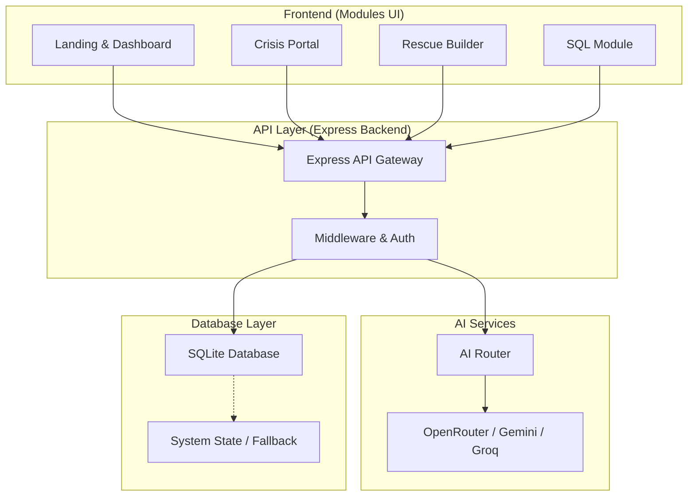

# 🚨 ResQAI – AI Crisis Intelligence System

**Empowering Rapid Emergency Response with AI-Driven Intelligence**

> ResQAI is a next-generation crisis management platform designed to bridge the gap between emergency onset and professional responder arrival. By leveraging multi-provider AI and real-time data, ResQAI provides life-saving guidance when every second counts.

---

## 🧠 Overview

In high-stress emergency scenarios—especially in hospitality and unfamiliar environments—individuals often lack clear, actionable information. **ResQAI** solves this by providing a unified, AI-powered interface that delivers:
- **Instant Evacuation Guidance**: Context-aware instructions based on the specific crisis.
- **Real-Time Incident Mapping**: Awareness of dangers within a 5km radius.
- **Automated Resource Discovery**: Immediate identification of nearest safe zones, hospitals, and police stations.
- **Language Accessibility**: Multi-lingual support to assist travelers and non-native speakers.

---

## 🏗️ Architecture

ResQAI utilizes a robust, multi-tier architecture designed for high availability and rapid response.



---

## 📁 Project Structure

```text
public/
  modules/          # Functional system modules (Crisis Portal, Rescue Builder)
  pages/            # Core application pages (SQL Module, Landing, Dashboard)
  scripts/          # Global client-side logic and animations
  styles/           # Design system and component styling
src/
  api/              # Express route handlers for all domains
  db/               # Database management (SQLite/MySQL support)
  middleware/       # Authentication and request validation
  utils/            # AI Routing, environment loading, and helpers
server.js           # Production-ready Express server entry point
```

---

## ⚙️ Features

### 🔴 Crisis Portal
- **SOS Activation**: One-tap emergency signal with automated location broadcasting.
- **Live Guidance**: Step-by-step AI instructions for various scenarios (Fire, Medical, Security).
- **Incident Map**: Visual representation of active threats and safe zones.

### 🏗️ Rescue Builder
- **No-Code System Creation**: Build custom emergency response systems for any organization.
- **Admin/User Panels**: Separate interfaces for coordination and individual response.
- **Template Engine**: Quick-start templates for hotels, schools, and offices.

### 📊 SQL Module
- **AI Data Interrogation**: Use natural language to query emergency logs and system state.
- **Incident Analytics**: Generate reports on response times and incident patterns.
- **Schema Explorer**: Real-time visibility into the system's data structure.

### 🤖 AI Integration
- **Contextual Intelligence**: LLMs specialized in emergency protocol and safety.
- **Voice-First Design**: Speech-to-text and text-to-speech for hands-free operation.
- **High Availability**: Redundant AI providers ensure the system works even during API outages.

---

## 🤖 AI Capabilities

- **AI Emergency Guidance**: Delivers instant, scenario-specific instructions (e.g., "How to treat a burn" or "Safest exit route from Room 402").
- **AI SQL Assistant**: Translates natural language questions like *"Show me all high-severity incidents in the last 2 hours"* into optimized SQL queries.
- **AI Router & Fallback**: A proprietary routing layer that automatically switches between **Gemini**, **OpenRouter**, and **Groq** to maintain zero downtime.

---

## 🌐 Deployment

ResQAI is built for scalability and production reliability:
- **Hybrid Deployment**: Runs seamlessly on local machines and is fully optimized for **Render**, **Heroku**, or **AWS**.
- **Production Guardrails**: Includes automated environment validation and database fallback mechanisms to handle unexpected server issues.
- **State Persistence**: Uses SQLite for lightweight local storage with easy migration paths to MySQL for enterprise scale.

---

## 📸 Screenshots

|  |  |
|:---:|:---:|
| **Operational Dashboard**: Real-time monitoring and incident tracking. | **Rescue Builder Admin**: Configuration of organizational safety nodes. |

|  |  |
|:---:|:---:|
| **Crisis Portal**: Hospitality-focused emergency guidance and SOS. | **Platform Entry**: Fast onboarding for users in distress. |

---

## 🧪 Tech Stack

- **Frontend**: HTML5, Vanilla JavaScript, Tailwind CSS (Design System).
- **Backend**: Node.js, Express.js.
- **Database**: SQLite3 (Production-ready with multi-tenant isolation).
- **AI Engine**: OpenRouter (Primary), Google Gemini, Groq LLM.
- **Location Services**: Leaflet.js & OpenStreetMap.

---

## 🔐 Environment Variables

To run this project, you will need to add the following environment variables to your `.env` file:

```env
OPENROUTER_PRIMARY_API_KEY=your_api_key_here
```

---

## ⚡ How to Run

1. **Install Dependencies**:
   ```bash
   npm install
   ```

2. **Configure Environment**:
   Create a `.env` file and add your `OPENROUTER_PRIMARY_API_KEY`.

3. **Start the System**:
   ```bash
   npm start
   ```
   *The system will be available at `http://localhost:3000`*

---

## 👥 Team

**Core Team:**
- **Souvik Dey** – Research Implementation, Lead Backend & Frontend Developer
- **Snehasis Chakraborty** – Idea Conceptualization & Developer
- **Partha Sarathi Sarkar** – Research, UI Design, Side Developer  
- **Samrat Chatterjee** – PPT Maker

---

## 🏁 Conclusion

ResQAI is more than just a dashboard; it is a **life-saving intelligence layer** that empowers individuals and organizations to act decisively during crises. By blending cutting-edge AI with accessible design, we are redefining the standard for modern emergency response.

---
**Built for Google Hackathon 🎯**
