# 🚨 ResQAI – AI Crisis Intelligence System

**Google Hackathon Project** | AI-powered real-time emergency detection & response with location-based crisis intelligence

> *When every second matters. Instant AI guidance. Safe zones. Evacuation routes. In any emergency.*

---

## 🎯 The Problem

In emergencies, **people have seconds to make critical decisions** but lack:

- ❌ Real-time awareness of nearby dangers
- ❌ Clear, step-by-step guidance on immediate actions  
- ❌ Knowledge of safe shelter locations nearby
- ❌ Quick evacuation routes to safety
- ❌ Language-accessible information (esp. for travelers)

**Result:** Panic. Delayed response. Preventable casualties.

---

## 💡 Our Solution: ResQAI

An **AI-powered emergency response system** that delivers:

✅ **Instant AI guidance** – Step-by-step evacuation instructions in seconds  
✅ **Live crisis alerts** – Real-time incident map within 5km radius  
✅ **Smart safe zones** – Auto-finds shelters/hospitals/police nearby  
✅ **Optimized routes** – Turn-by-turn navigation to nearest safety  
✅ **Voice activation** – Speak emergency keywords, no typing needed  
✅ **Multi-language** – English, Hindi, Bengali support  
✅ **Zero downtime** – Multi-AI fallback system (Gemini → OpenRouter → Groq)

---

## 🖼️ Visual Overview

### 🚀 Product Walkthrough (Click to Explore)

<table>
<tr>
<td align="center">
<br>
<b>Landing Page</b><br>
<sub>Instant AI-guided emergency response</sub>
</td>

<td align="center">
<br>
<b>System Selection</b><br>
<sub>Choose your rescue system</sub>
</td>
</tr>

<tr>
<td align="center">
<br>
<b>Live Crisis Dashboard</b><br>
<sub>Real-time alerts within 5km</sub>
</td>

<td align="center">
<br>
<b>Hotel Emergency Module</b><br>
<sub>Smart safety for every guest</sub>
</td>
</tr>

<tr>
<td align="center" colspan="2">
<br>
<b>Admin Command Center</b><br>
<sub>Real-time coordination & control</sub>
</td>
</tr>
</table>

---


## 🧠 Key Features

### 1. **Multi-Channel Emergency Reporting**
- **Form-based:** Describe emergency + location
- **Voice-first:** Say "Fire!" or "Medical emergency!" 
- **One-tap SOS:** Instant alarm + location broadcast

### 2. **Real-Time AI Evacuation Guidance**
- Google Gemini generates contextual instructions
- Immediate action steps ("What do I do RIGHT NOW?")
- Panic-proof, structured responses
- Fallback to secondary AI if primary fails

### 3. **Live Crisis Alerts Dashboard**
- Nearby incidents within 5km radius
- Color-coded severity (Low/Medium/High)
- Distance + ETA to each incident
- Auto-refresh every 60 seconds

### 4. **Smart Safe Zone Discovery**
- Auto-finds shelters, hospitals, police stations
- Uses OpenStreetMap live data
- Enforced 5km max distance (no far-away suggestions)
- Real-time availability info

### 5. **AI-Guided Evacuation Routes**
- Optimal path to nearest safe zone
- Turn-by-turn directions on interactive map
- Real-time distance & ETA
- Integration with evacuation guidance

### 6. **Voice Emergency Detection**
- Detect keywords: fire, flood, medical, earthquake, accident
- Instant guidance trigger (no form needed)
- Voice synthesis reads guidance back to user
- Works in noisy environments

---

---

## Full Project Architecture

## 🧠 System Architecture

```mermaid
flowchart LR

subgraph CLIENT["Client Layer"]
A1[Rapid Crisis Protocol]
A2[EcoPlus - Hotel Module]
A3[SQBitain - Custom Builder]
A4[Voice + Location APIs]
end

subgraph API["Express API Gateway"]
B1["/api/emergencies"]
B2["/api/ai"]
B3["/api/portal"]
B4["/api/custom-system"]
end

subgraph CORE["Core System"]
C1["AI Router<br/>Gemini → OpenRouter → Groq"]
C2["SOS | Alerts | Guidance"]
C3["SQLite + MySQL-ready"]
end

subgraph SYSTEM["Runtime"]
D1[Operational State]
D2["Multi-Tenant Isolation<br/>systemID"]
end

CLIENT --> API
API --> CORE
CORE --> SYSTEM
```



### Frontend Architecture

| Frontend Area | Purpose | Key Files |
|---|---|---|
| App Entry + Navigation | Entry flow, module selection, transitions | public/pages/landing.html, public/pages/index.html, public/scripts/app.js |
| Rapid Crisis Protocol | Incident reporting, dashboard, nearby alerts, chat/voice UX | public/scripts/modules/dashboard.js, public/scripts/modules/nearby.js, public/scripts/modules/chatbot.js, public/scripts/modules/voice.js |
| EcoPlus Module | Hotel/resort emergency workflows (guest + admin) | public/modules/echo-plus/index.html, public/modules/echo-plus/js/app.js, public/modules/echo-plus/js/module.js, public/modules/echo-plus/js/ai-safe.js |
| SQBitain (Custom Builder) | Multi-step rescue system builder with admin/user panels | public/modules/rescue-builder/index.html, public/modules/rescue-builder/js/builder.js, public/modules/rescue-builder/js/templates.js |

### Backend Architecture

| Layer | Responsibility | Key Files |
|---|---|---|
| Server Bootstrap | Env loading, middleware, route mounting, static serving | src/server.js |
| API Routes | Business endpoints by domain | src/api/routes/*.js |
| AI Router | Provider fallback, retries/timeouts, emergency-safe fallback text | src/utils/aiRouter.js |
| Configuration + Validation | Environment and AI status checks | src/utils/validateEnv.js, src/config/index.js |
| Data Access | SQLite core with MySQL support path | src/db/db.js, src/db/mysql.js, src/db/init.js |

---


## ⚙️ Tech Stack

| Layer | Technology |
|-------|-----------|
| **Frontend** | HTML5, CSS3, JavaScript, Leaflet.js (Maps), Web Speech API |
| **Backend** | Node.js, Express.js |
| **AI** | Google Gemini 2.5, OpenRouter, Groq |
| **Database** | SQLite3 |
| **Location** | OpenStreetMap Overpass, OpenRouteService, Mapbox |
| **Voice** | Web Speech API (recognition + synthesis) |

---

## 🔁 Multi-AI Fallback System

**Why this matters:** Emergency systems cannot afford downtime.

```
Request for AI Guidance
        ↓
   [Try Gemini]
        ↓
   Failed? ↘
   [Try OpenRouter - Primary Key]
        ↓
   Failed? ↘
   [Try OpenRouter - Secondary Key]
        ↓
   Failed? ↘
   [Try Groq]
        ↓
   Failed? ↘
   [Use Cached Template]
        ↓
   ✅ Always responds with guidance
```

**Configuration:** `AI_PROVIDER_PRIORITY` env variable allows custom priority order.

---

## 📊 Example Workflows

### Scenario 1: Form-Based Emergency Report
```
User: "Fire in my building!"
     ↓
[Auto-capture location via geolocation]
[AI classifies: FIRE | Severity: HIGH]
     ↓
[Parallel Actions]
├─ Gemini generates: "Evacuate NOW. Use stairs, not elevators..."
├─ Find safe zones: Hospital (2.3km), Community Center (1.8km)
└─ Calculate routes: Optimal path + turn-by-turn
     ↓
Response: 
"🚨 IMMEDIATE ACTIONS:
 1. Evacuate using stairs
 2. Stay low to avoid smoke
 3. Don't stop for belongings
 4. Meet outside at assembly point
 
 📍 NEAREST SAFE ZONE (1.8 km):
    Community Center - Shelter & First Aid
    ➜ Route: Turn right → Left on 5th Ave"
```

### Scenario 2: Voice Emergency
```
User: [Speaks] "Flood nearby!"
     ↓
[Web Speech Recognition: Confidence 0.92]
[Detected Intent: FLOOD]
     ↓
[System triggers immediate actions]
├─ AI generates flood evacuation guide
├─ Loads safe zones (within 5km)
└─ Preloads optimal evacuation route
     ↓
System responds (voice + text):
"🚨 FLOOD ALERT! Move to higher ground.
 ✅ Safe Zone: Hospital (1.8 km away)
 📍 Directions loading..."
```

---

## 🏥 Use Case: Hospitality & Guests

**The Problem:** Hotel guests face emergencies in unfamiliar places.

**ResQAI Solution:**
- Guests get **instant guidance in their language**
- Hotel staff gets **real-time command center** (floor map, staff coordination)
- **AI guides evacuation** while staff manage operations
- **Zero language barriers** (English, Hindi, Bengali)

**Result:** Faster evacuation, better coordination, fewer casualties.

---

## 🚀 Setup Instructions

### Prerequisites
- Node.js 16+ 
- npm or yarn
- API keys (see below)

### Installation

```bash
# 1. Clone repository
git clone <repo-url>
cd "Rapid Crisis Response"

# 2. Install dependencies
npm install

# 3. Setup environment
cp .env.example .env

# 4. Add API keys to .env (see next section)

# 5. Start server
npm start
```

**Server runs on:** `http://localhost:3000`

---

## 🎯 Why ResQAI Stands Out

| Feature | Traditional Systems | ResQAI |
|---------|-------------------|--------|
| **Guidance** | Slow website + phone queue | AI instant response |
| **Safe Zones** | Manual search | Auto-find within 5km |
| **Language** | English only | 3+ languages |
| **Reliability** | Single provider | 4-tier fallback |
| **Speed** | Minutes | Seconds |
| **Accessibility** | Requires typing | Voice-first |

---

## 🔮 Future Scope

- 🌦️ Real-time weather integration for incident prediction
- 👥 Community crowdsourced incident reporting
- 📲 Native mobile apps (iOS/Android)
- 🚑 Emergency dispatch system integration
- 🏢 Enterprise admin dashboard
- 🌐 Government emergency API integration
- 📊 Post-incident analytics & reports
- 🎯 Advanced incident pattern recognition

---

## 👥 Team

**Team Leader:**
- **Snehasis Chakraborty** – Idea Conceptualization & Developer

**Core Team:**
- **Souvik Dey** – Research Implementation, Lead Backend Developer
- **Partha Sarathi Sarkar** – Research, UI Design, Side Developer  
- **Samrat Chatterjee** – PPT Design Side Developer

---

## 📁 Project Structure

```
ResQAI/
├── src/
│   ├── server.js
│   ├── api/routes/
│   │   ├── ai.js
│   │   ├── emergency.js
│   │   ├── portal.js
│   │   └── voice.js
│   ├── utils/
│   │   ├── aiRouter.js (Multi-provider logic)
│   │   └── validateEnv.js
│   └── db/
│       └── db.js
├── public/
│   ├── pages/
│   ├── scripts/modules/
│   │   ├── nearby.js
│   │   ├── voice.js
│   │   └── rapid-portal.js
│   └── styles/
├── docs/
│   └── images/
└── .env.example
```

---

## 📝 Key Statistics

- ⏱️ **Response Time:** <2 seconds for AI guidance
- 📍 **Coverage Radius:** 5km (enforced max distance)
- 🗣️ **Languages Supported:** English, Hindi, Bengali  
- 🔄 **AI Providers:** 4 (Gemini, OpenRouter x2, Groq) + cached fallback
- 📡 **Real-time Updates:** Every 60 seconds

---

## 🏁 Conclusion

ResQAI transforms emergency response from **reactive to proactive**. By combining:
- **AI guidance** (step-by-step instructions)
- **Real-time intelligence** (live incident map)
- **Smart location services** (safe zones)
- **Voice accessibility** (no typing in panic)
- **Enterprise reliability** (multi-provider fallback)

We enable **anyone to respond effectively to any emergency**, anywhere.

---

## 📜 License

MIT License – Open for contributions

---

**Built for Google Hackathon 🎯**

Questions? Check our [documentation](./docs/) or open an issue.

```bash
# Get started now:
npm install && npm start
```

**Your emergency response system is 3 commands away.**