# 🏗️ System Architecture

## System Architecture Diagram

```mermaid
flowchart LR

subgraph CLIENT["Client Layer"]
A1[Rapid Crisis Protocol]
A2[EcoPlus - Hotel Module]
A3[SQBitain - Custom Builder]
A4[Voice + Location APIs]
end

subgraph API["Express API Gateway"]
B1["/api/emergencies"]
B2["/api/ai"]
B3["/api/portal"]
B4["/api/custom-system"]
B5["/api/classification"]
B6["/api/chat"]
end

subgraph CORE["Core System"]
C1["AI Router<br/>Gemini → OpenRouter → Groq → Free"]
C2["Classification<br/>Engine"]
C3["SOS Manager<br/>Helpline Mapping"]
C4["Language<br/>Support"]
end

subgraph DATA["Data Layer"]
D1["SQLite<br/>(Development)"]
D2["MySQL<br/>(Production)"]
D3["Auth & Sessions"]
D4["System Isolation<br/>(systemID pattern)"]
end

CLIENT -->|REST API| API
API -->|Process| CORE
CORE -->|Read/Write| DATA
```



---

## 4-Layer Architecture

### 1️⃣ **Client Layer** (Frontend)
**Location**: `public/`

**Components**:
- **Rapid Crisis Protocol** (`public/pages/guest-crisis-portal.html`)
  - Main emergency response interface
  - Real-time incident mapping
  - AI chatbot integration
  - Voice command system
  
- **EcoPlus Module** (`public/modules/echo-plus/`)
  - Hotel-specific emergency workflows
  - Guest & Admin interfaces
  - Room/floor position tracking
  - Staff coordination dashboard
  
- **SQBitain Builder** (`public/modules/rescue-builder/`)
  - Custom system creation
  - Template generation
  - Organization structure builder
  - System management UI

**Technologies**:
- HTML5, CSS3, Vanilla JavaScript
- Leaflet.js (mapping)
- Web Speech API (voice)
- localStorage (client-side persistence)
- WebSocket ready (future)

---

### 2️⃣ **API Layer** (Express Routes)
**Location**: `src/api/routes/`

**Route Files**:
| File | Endpoints | Purpose |
|------|-----------|---------|
| `auth.js` | POST /register, /login, /verify, /logout | User authentication & JWT management |
| `emergencies.js` | GET /, GET /:id, POST /, PATCH /:id, DELETE /:id | Emergency CRUD & filtering |
| `classification.js` | POST / | AI-powered incident classification |
| `chat.js` | POST /, GET /health | Multi-language chatbot |
| `voice.js` | POST /speak, /transcribe, /transcribe-callback | Voice integration |
| `nearby.js` | GET /nearby, GET /incident/:id, POST /alert | Location-based incidents |
| `ai.js` | GET /health, POST /emergency-guidance, POST /test-ai | AI provider testing & guidance |
| `portal.js` | GET /safety-tip, POST /sos-log, POST /ai-guide, GET /safe-zones | Crisis response coordination |
| `custom-system.js` | POST /create, GET /:systemID, PATCH /:systemID, DELETE /:systemID | Custom system management |
| `aicall.js` | Voice call orchestration | AI-powered voice interactions |

**Server Bootstrap**: `src/server.js`
- Express initialization
- Middleware registration
- Static file serving
- Route mounting
- Error handling

---

### 3️⃣ **Core Layer** (Business Logic)

#### **AI Router** (`src/utils/aiRouter.js`)
Multi-provider fallback orchestration:

```
User Prompt
    │
    ▼
┌─────────────────────┐
│ AI Router Selector  │
└────────┬────────────┘
         │
    ┌────┴────────────────────────┐
    │                             │
    ▼                             ▼
┌──────────────┐        ┌──────────────────┐
│   Gemini     │        │ Fallback Chain   │
│ (Primary)    │        │ Active Check     │
│ 30s timeout  │        │ (OpenRouter/Groq)│
└──────┬───────┘        └──────────────────┘
       │                        │
       ├─ Success? Return       │
       │                        │
       └─ Fail? Try Next ──────►│
                               │
                    ┌──────────┴─────────┐
                    │                    │
                    ▼                    ▼
              ┌──────────┐         ┌──────────┐
              │OpenRouter│         │ Groq     │
              │ 30s TO   │         │ 30s TO   │
              └──────┬───┘         └──────┬───┘
                     │                    │
                     └────────┬───────────┘
                              │
                         Fail Both?
                              │
                              ▼
                     ┌────────────────┐
                     │ Free Fallback  │
                     │ Pollinations.ai│
                     │ (No API Key)   │
                     └────────────────┘
```

**Provider Configuration** (via environment variables):
```env
# Primary
GEMINI_API_KEY=<your-key>
GEMINI_MODEL=gemini-2.5-flash  # Configurable

# Secondary
OPENROUTER_API_KEY=<primary-key>
OPENROUTER_SECONDARY_API_KEY=<fallback-key>
OPENROUTER_MODEL=meta-llama/llama-3-8b-instruct

# Tertiary
GROQ_API_KEY=<your-key>
GROQ_MODEL=mixtral-8x7b-32768

# Timeout
AI_TIMEOUT=30000  # milliseconds
```

**Key Functions**:
- `generateAIResponse(prompt, language)` - Routes to available provider
- `getAIRouterStatus()` - Returns active providers
- `getLastAIUsageReport()` - Logs usage statistics

#### **Classification Engine** (`src/api/routes/classification.js`)
Uses AI Router to classify emergencies:

**Input**:
```json
{
  "description": "Fire in the building",
  "language": "en"  // en, hi, bn
}
```

**AI-Generated Output**:
```json
{
  "type": "fire",  // fire|flood|medical|accident|other
  "confidence": 0.95,
  "reasoning": "Description mentions active fire",
  "immediate_actions": [
    "Evacuate immediately",
    "Call 101",
    "Use nearest exit"
  ],
  "step_by_step": [
    "Leave the building via nearest safe exit",
    "Move to assembly point at least 100m away",
    "Wait for emergency services",
    "Provide information to fire personnel"
  ],
  "prevention_tips": [
    "Check fire extinguishers monthly",
    "Keep escape routes clear",
    "Practice fire drills quarterly"
  ],
  "risk_scores": {
    "flood_risk": 0.1,
    "fire_risk": 0.95,
    "accident_risk": 0.3,
    "medical_risk": 0.2
  }
}
```

#### **Multi-Language Support** (`src/utils/languages.js`)
Supported languages:
- **English** (en) - Default
- **Hindi** (hi) - India-specific
- **Bengali** (bn) - Bangladesh-specific

System prompts are generated in target language for better cultural context.

#### **SOS Management** (`src/api/routes/portal.js`)
Maps emergency types to helpline numbers:

```javascript
const HELPLINE_MAP = {
  'fire': { number: '101', name: 'Fire Brigade' },
  'medical': { number: '108', name: 'Ambulance' },
  'police': { number: '100', name: 'Police' },
  'flood': { number: '1078', name: 'Disaster Management' },
  'accident': { number: '101/108', name: 'Emergency Services' }
}
```

---

### 4️⃣ **Data Layer** (Database & Persistence)

#### **SQLite** (Development)
**File**: `emergencies.db`

**Tables**:

**emergencies**
```sql
CREATE TABLE IF NOT EXISTS emergencies (
  id TEXT PRIMARY KEY,
  description TEXT,
  location TEXT,
  severity TEXT,  -- low|medium|high
  status TEXT,    -- pending|resolved|dismissed
  classified_type TEXT,  -- fire|flood|medical|accident|other
  confidence_score REAL,
  ai_suggestions TEXT,
  image_url TEXT,
  created_at DATETIME DEFAULT CURRENT_TIMESTAMP,
  updated_at DATETIME DEFAULT CURRENT_TIMESTAMP
);
CREATE INDEX idx_status ON emergencies(status);
CREATE INDEX idx_created ON emergencies(created_at);
CREATE INDEX idx_type ON emergencies(classified_type);
```

**chat_history**
```sql
CREATE TABLE IF NOT EXISTS chat_history (
  id INTEGER PRIMARY KEY AUTOINCREMENT,
  user_message TEXT,
  bot_response TEXT,
  timestamp DATETIME DEFAULT CURRENT_TIMESTAMP
);
```

**custom_rescue_systems**
```sql
CREATE TABLE IF NOT EXISTS custom_rescue_systems (
  id TEXT PRIMARY KEY,
  organization_name TEXT,
  organization_type TEXT,  -- school|hospital|hostel|restaurant|custom
  location TEXT,
  contact_email TEXT,
  structure_json TEXT,  -- JSON: floors, buildings, zones
  staff_json TEXT,      -- JSON: staff roles & assignments
  risk_types_json TEXT, -- JSON: risk categories
  status TEXT,          -- active|monitoring|emergency
  created_at DATETIME DEFAULT CURRENT_TIMESTAMP,
  updated_at DATETIME DEFAULT CURRENT_TIMESTAMP
);
CREATE INDEX idx_status ON custom_rescue_systems(status);
CREATE INDEX idx_created ON custom_rescue_systems(created_at);
```

#### **MySQL** (Production)
**Database**: `resqai_db`

**users** (User authentication)
```sql
CREATE TABLE users (
  id VARCHAR(36) PRIMARY KEY,
  email VARCHAR(255) UNIQUE NOT NULL,
  password_hash VARCHAR(255) NOT NULL,
  first_name VARCHAR(100),
  last_name VARCHAR(100),
  organization VARCHAR(255),
  created_at TIMESTAMP DEFAULT CURRENT_TIMESTAMP,
  updated_at TIMESTAMP DEFAULT CURRENT_TIMESTAMP
);
CREATE INDEX idx_email ON users(email);
CREATE INDEX idx_created ON users(created_at);
```

**systems** (Multi-tenant custom systems)
```sql
CREATE TABLE systems (
  id VARCHAR(36) PRIMARY KEY,
  user_id VARCHAR(36) NOT NULL,
  organization_name VARCHAR(255) NOT NULL,
  organization_type VARCHAR(50),
  location VARCHAR(255),
  contact_email VARCHAR(255),
  structure_json LONGTEXT,
  staff_json LONGTEXT,
  risk_types_json LONGTEXT,
  status VARCHAR(50),
  created_at TIMESTAMP DEFAULT CURRENT_TIMESTAMP,
  updated_at TIMESTAMP DEFAULT CURRENT_TIMESTAMP,
  FOREIGN KEY (user_id) REFERENCES users(id) ON DELETE CASCADE,
  INDEX idx_user (user_id),
  INDEX idx_status (status),
  INDEX idx_created (created_at)
);
```

**system_logs** (Audit trail)
```sql
CREATE TABLE system_logs (
  id INT AUTO_INCREMENT PRIMARY KEY,
  system_id VARCHAR(36) NOT NULL,
  action VARCHAR(100),
  details LONGTEXT,
  created_at TIMESTAMP DEFAULT CURRENT_TIMESTAMP,
  FOREIGN KEY (system_id) REFERENCES systems(id) ON DELETE CASCADE,
  INDEX idx_system (system_id),
  INDEX idx_created (created_at)
);
```

**sessions** (User sessions)
```sql
CREATE TABLE sessions (
  id INT AUTO_INCREMENT PRIMARY KEY,
  user_id VARCHAR(36) NOT NULL,
  token VARCHAR(500),
  expires_at TIMESTAMP,
  created_at TIMESTAMP DEFAULT CURRENT_TIMESTAMP,
  FOREIGN KEY (user_id) REFERENCES users(id) ON DELETE CASCADE,
  INDEX idx_user (user_id),
  INDEX idx_expires (expires_at)
);
```

---

## Authentication & Security

### JWT Implementation
**File**: `src/middleware/auth.js`

- **Secret**: `process.env.JWT_SECRET` (default: 'resqai-secret-key-change-in-production')
- **Expiry**: 7 days
- **Algorithm**: HS256

**Middleware Functions**:

1. **`verifyToken(req, res, next)`**
   - Requires: `Authorization: Bearer <token>` header
   - Validates & decodes JWT
   - Sets: `req.user = { userID, email }`
   - Returns 401 if invalid/missing

2. **`optionalAuth(req, res, next)`**
   - Optional: Attempts to set `req.user` if token exists
   - Continues regardless of success/failure
   - Used for public endpoints with optional auth benefits

**Usage in Routes**:
```javascript
// Requires authentication
router.post('/:systemID', verifyToken, updateSystemHandler);

// Optional authentication
router.post('/create', optionalAuth, createSystemHandler);

// Public (no auth)
router.post('/', createEmergencyHandler);
```

---

## Multi-Tenant Isolation Pattern

### SystemID-Based Isolation

**How it works**:

1. **System Creation**
   ```javascript
   const systemID = generateUUID();
   const userID = req.user?.userID || 'anonymous-' + generateUUID();
   
   // Save with ownership
   db.insert('systems', { id: systemID, user_id: userID, ... });
   ```

2. **System Listing** (User only sees own systems)
   ```javascript
   SELECT * FROM systems WHERE user_id = ?  // userID parameter
   ```

3. **System Updates** (Ownership validation)
   ```javascript
   // Before allowing update:
   const system = db.query('SELECT user_id FROM systems WHERE id = ?', [systemID]);
   if (system.user_id !== userID) {
     return 403 Forbidden;
   }
   ```

4. **Anonymous Users**
   - Users without JWT get: `'anonymous-' + UUID`
   - Systems created under anonymous ID
   - No persistence across sessions (localStorage only)
   - For public/demo access

---

## Request/Response Flow

### Example: SOS Emergency

```
1. USER INITIATES
   POST /api/portal/sos-log
   {
     "emergencyType": "fire",
     "latitude": 40.7128,
     "longitude": -74.0060,
     "language": "en",
     "description": "Fire on 3rd floor"
   }

2. SERVER PROCESSES
   └─ middleware/auth.js (optionalAuth)
   └─ portal.js route handler
   └─ SOS validation
   └─ AI Router → Classification
   └─ Helpline lookup

3. RESPONSE SENT
   {
     "sosId": "sos-uuid-123",
     "emergencyType": "fire",
     "helpline_number": "101",
     "helpline_name": "Fire Brigade",
     "ai_suggestion": "Step-by-step guidance...",
     "confidence": 0.95,
     "safe_zones": [
       { "name": "Assembly Point A", "distance": 150 }
     ]
   }

4. CLIENT DISPLAYS
   └─ Helpline number prominently
   └─ AI guidance in chat
   └─ Nearby safe zones on map
   └─ Continues monitoring location
```

---

## Environment Configuration

**Required Variables**:
```env
# Server
PORT=3000
NODE_ENV=development

# Database
DB_PATH=./emergencies.db

# AI - Primary
GEMINI_API_KEY=<your-key>

# AI - Secondary (optional)
OPENROUTER_API_KEY=<your-key>
GROQ_API_KEY=<your-key>

# Security
JWT_SECRET=<your-secret>

# Timeouts
AI_TIMEOUT=30000
```

---

## Performance & Reliability

### Timeout Strategy
- AI requests: 30 seconds max
- Database queries: 5 seconds max
- WebSocket connections: 60 seconds idle timeout

### Fallback Strategy
1. **Gemini** → Try OpenRouter
2. **OpenRouter** → Try Groq
3. **Groq** → Use cached response or template
4. **All fail** → Return pre-built emergency guidance

### Monitoring
- `GET /api/ai/health` - Check provider availability
- Logs provider usage on each request
- Tracks failure rates for debugging

---

## Deployment Considerations

- **Production Database**: Switch to MySQL
- **API Keys**: Store in secure environment vault
- **CORS**: Configure for domain whitelist
- **Rate Limiting**: Consider for public endpoints
- **SSL/TLS**: Enable for production
- **Load Balancing**: Use Redis for session storage

---

**Architecture designed for rapid response, reliability, and scalability** 🚀
